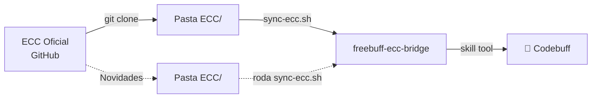

# 🧠 freebuff-ecc-bridge

**Ponte de adaptação entre o ECC (Agent Harness Performance Optimization System) e o Codebuff.**

## 📋 O que é

Este projeto conecta o ecossistema [ECC](https://github.com/affaan-m/ECC) (224k+ estrelas)
— originalmente criado para Claude Code — com o **Codebuff**, adaptando skills, agentes
e regras para o formato nativo do Codebuff.

## 📁 Estrutura

```
freebuff-ecc-bridge/
├── .codebuff/
│   └── instructions.md      # Regras adaptadas do ECC para o Codebuff
├── skills/                  # Skills adaptadas (formato Codebuff)
│   ├── quality-gate.md      # Portão de qualidade (ECC: delivery-gate)
│   ├── continuous-learning.md  # Aprendizado contínuo (ECC: continuous-learning-v2)
│   ├── data-scraper.md      # Coleta de dados (ECC: data-scraper-agent)
│   ├── verification-loop.md # Loops de verificação (ECC: verification-loop)
│   └── deep-research.md     # Pesquisa profunda (ECC: deep-research)
│   └── ... (mais 17 geradas automaticamente!)
├── agents/                  # Agentes adaptados
├── scripts/
│   └── sync-ecc.sh          # Script de sincronização ECC → Bridge
├── logs/                    # Relatórios de sincronização
└── README.md                # Este arquivo
```

## 🚀 Como usar no dia a dia

### 1. Sincronizar com o ECC oficial (quando quiser atualizar)

```bash
cd freebuff-ecc-bridge
./scripts/sync-ecc.sh
```

Isso **atualiza o clone do ECC** e **gera versões adaptadas** automaticamente.

### 2. Usar uma skill durante a conversa no Codebuff

Dentro do Codebuff (na pasta do bridge ou do projeto Freebuff), digite:

```
skill "quality-gate"
```

A skill será carregada e você poderá seguir as instruções.

### 3. Usar um agente durante a conversa

Mencione o agente com @Nome:

```
@architect me ajude a projetar o pipeline de dados
```

## 📊 Status atual

| Item | Status |
|------|--------|
| ECC clonado | ✅ |
| Script de sincronização (`sync-ecc.sh`) | ✅ Testado |
| Skills adaptadas do ECC | **22** (5 manuais + 17 automáticas) |
| Agentes adaptados do ECC | **5** |
| Relatório de sincronização | ✅ `logs/sync-20260701-*.md` |

## 🔄 Fluxo de atualização



## 💡 Para o seu uso diário

1. **Codebuff aberto na pasta `freebuff-ecc-bridge/`** → skills disponíveis
2. **Codebuff aberto na pasta `Dados_Municipios_BR/`** → dados
3. **Codebuff aberto na pasta `Relatorio-Municipios-AM/`** → relatórios
4. **Quando quiser atualizar** → `cd freebuff-ecc-bridge && ./scripts/sync-ecc.sh`

---

*Projeto criado em 01/07/2026*
