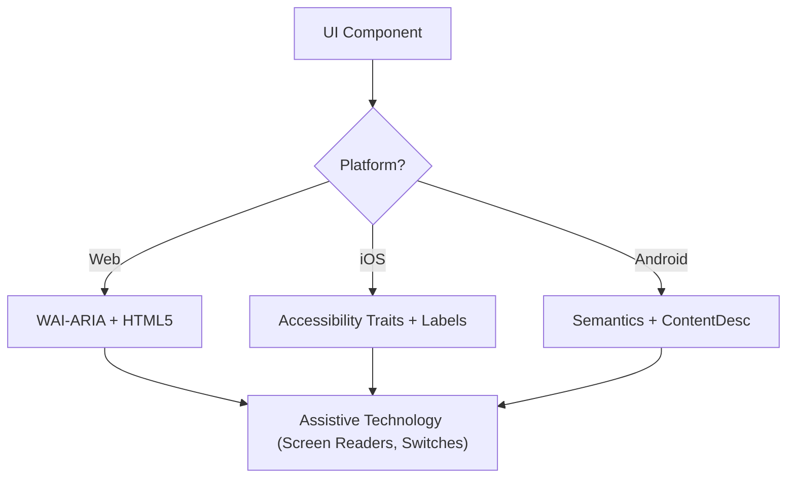

# 🧠 Skill: accessibility

> **Adaptada do ECC:** `accessibility` — via `sync-ecc.sh`
> **Fonte original:** `ECC/skills/accessibility/SKILL.md`

## Descrição

Design, implement, and audit inclusive digital products using WCAG 2.2 Level AA

---

## ⚠️ Adaptação para Codebuff

| Conceito ECC (Claude) | Equivalente Codebuff |
|-----------------------|---------------------|
| Hooks | Instruções no `.codebuff/instructions.md` |
| Comandos slash | Skills via `skill` tool |
| `settings.json` | `.codebuff/instructions.md` |
| Rules em `~/.claude/rules/` | Skills em `.agents/skills/` |

---

## Conteúdo Adaptado

# Accessibility (WCAG 2.2)

This skill ensures that digital interfaces are Perceivable, Operable, Understandable, and Robust (POUR) for all users, including those using screen readers, switch controls, or keyboard navigation. It focuses on the technical implementation of WCAG 2.2 success criteria.

## When to Use

- Defining UI component specifications for Web, iOS, or Android.
- Auditing existing code for accessibility barriers or compliance gaps.
- Implementing new WCAG 2.2 standards like Target Size (Minimum) and Focus Appearance.
- Mapping high-level design requirements to technical attributes (ARIA roles, traits, hints).

## Core Concepts

- **POUR Principles**: The foundation of WCAG (Perceivable, Operable, Understandable, Robust).
- **Semantic Mapping**: Using native elements over generic containers to provide built-in accessibility.
- **Accessibility Tree**: The representation of the UI that assistive technologies actually "read."
- **Focus Management**: Controlling the order and visibility of the keyboard/screen reader cursor.
- **Labeling & Hints**: Providing context through `aria-label`, `accessibilityLabel`, and `contentDescription`.

## How It Works

### Step 1: Identify the Component Role

Determine the functional purpose (e.g., Is this a button, a link, or a tab?). Use the most semantic native element available before resorting to custom roles.

### Step 2: Define Perceivable Attributes

- Ensure text contrast meets **4.5:1** (normal) or **3:1** (large/UI).
- Add text alternatives for non-text content (images, icons).
- Implement responsive reflow (up to 400% zoom without loss of function).

### Step 3: Implement Operable Controls

- Ensure a minimum **24x24 CSS pixel** target size (WCAG 2.2 SC 2.5.8).
- Verify all interactive elements are reachable via keyboard and have a visible focus indicator (SC 2.4.11).
- Provide single-pointer alternatives for dragging movements.

### Step 4: Ensure Understandable Logic

- Use consistent navigation patterns.
- Provide descriptive error messages and suggestions for correction (SC 3.3.3).
- Implement "Redundant Entry" (SC 3.3.7) to prevent asking for the same data twice.

### Step 5: Verify Robust Compatibility

- Use correct `Name, Role, Value` patterns.
- Implement `aria-live` or live regions for dynamic status updates.

## Accessibility Architecture Diagram

## Cross-Platform Mapping

| Feature            | Web (HTML/ARIA)          | iOS (SwiftUI)                        | Android (Compose)                                           |
| :----------------- | :----------------------- | :----------------------------------- | :-------------------------------------

---

**ECC Original:** `ECC/skills/accessibility/SKILL.md`
**Atualizado em:** 2026-07-02 22:11:18
